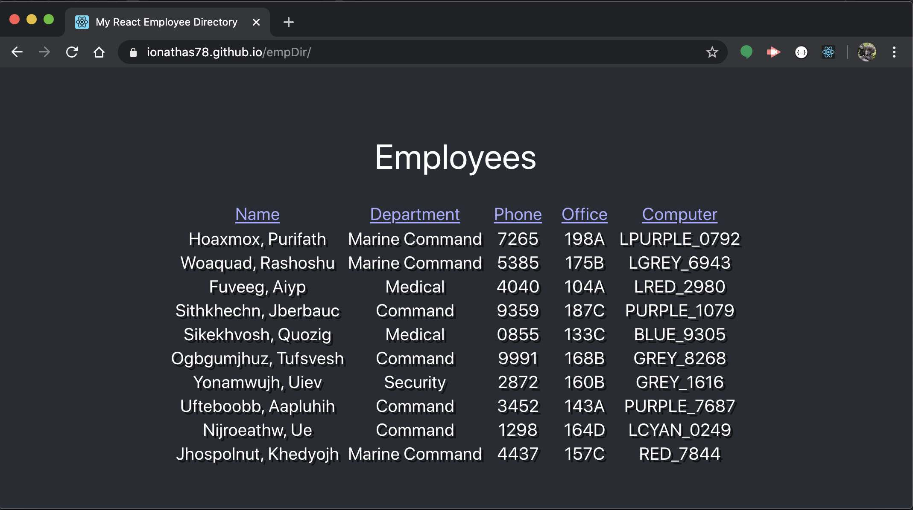
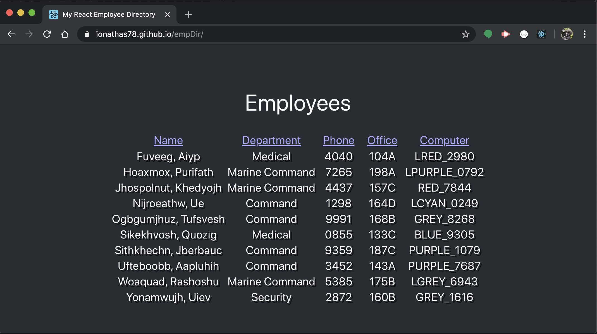
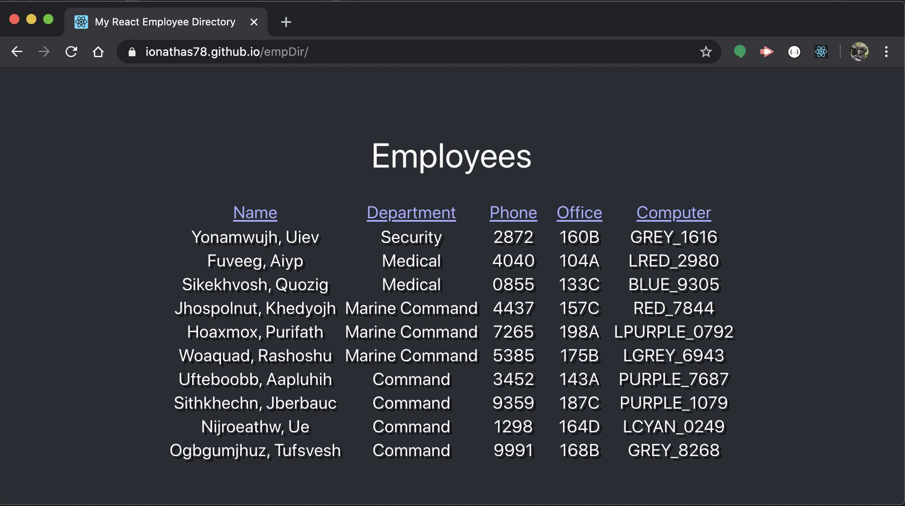

# empDir - React Employee Directory
[](https://opensource.org/licenses/MIT)

> React-ive Directory Listing for Employees

React seems like a natural library for a directory listing applet,
as it'd be easy to integrate it as a component in a larger web page
with multiple moving pieces. As such, I developed this exercise as a tool
for the IT department that would give them contact information for each user.
Naturally, you'd expect the employee data to be stored in the company database.
Since I didn't have one of those handy, though, I came up with a random name
generator that would make up exotic-sounding names for my random employees.
I set up a field for managers, since an IT worker would normally contact an
employee's manager before doing any work that might halt production, but I
didn't have time to implement that field in the finished app. Maybe I'll add
it in the future...

## Graphic


## User Story

```
AS AN IT Professional 
I WANT A working employee directory
SO THAT I can reach the users whose computers I'm updating
```

```
GIVEN THAT I hit the directory website
WHEN I click a column
THEN it should sort alphabetically
WHEN I click the same column again
THEN it should reverse the sort order
```

## Table of Contents
* [Technologies](#Technologies)
* [Getting Started](#Getting)
* [Usage](#Usage)
* [Project Status](#Project)
* [Frequently Asked Questions](#FAQ)
* [Questions](#Additional)
* [Contributing](#Contributing)
* [License](#License)

## Technologies
Node.js\
React\
gh-pages

## Getting Started
```
npm install
```
Since there's no database to seed for this project, you can just run the standard npm installation to fetch all the module dependencies for you. 
Note that React can take a while to download. 
If you'll be running this locally, you'll need to comment out the "homepage" entry in the package.json file
```
//  "homepage": "http://ionathas78.github.io/empDir/"
```

## Usage
```
npm start
```
Once the app is running, all you have to do is hit localhost:3000 in your web browser and it will load automatically. You can click one of the column headers to sort alphanumerically by that column. If you click the same column again, it'll sort by reverse alpha. Refreshing the page will generate a new set of names and info.




## Project Status
Finished

## Additional Questions
Contact me by email or DM.

## Contributing
Contact us for guidelines on submitting contributions.

## License
This project is licensed under the The MIT License.


### ionathas78

This file generated on 5/12/2020 by goodReadMeGenerator, copyright 2020 Jonathan Andrews

